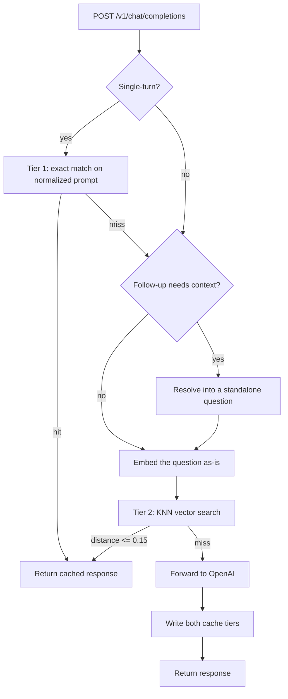

# LLM Gateway

A caching reverse proxy for the OpenAI chat completions API. It speaks the same
wire format, so an existing client points at it by changing one URL, and it
answers repeat questions from Redis instead of paying for them again.

Every response carries an `X-Cache` header naming the tier that served it, so
none of the claims below have to be taken on trust.

Built with FastAPI and Redis Stack.

## Why

LLM calls are slow and metered. In most real workloads a meaningful share of
traffic is repetitive — the same question asked twice, or the same question
asked in different words. An exact-match cache only catches the first case.

This gateway adds a semantic tier for the second, and resolves conversational
follow-ups so that "how does it work?" can match a question asked outright in a
different conversation.

## How it works



**Tier 1 — exact match.** Single-turn requests are keyed on a SHA-256 of the
prompt with casing and whitespace normalized, scoped by model, temperature, and
system prompt. `"  WHAT IS REDIS?  "` and `"what is redis?"` share an entry.

Multi-turn requests skip this tier. The same follow-up has a different correct
answer in every conversation it appears in, and caching it globally would serve
one conversation's answer to another.

**Tier 2 — semantic match.** The question is embedded with
`text-embedding-3-small` and matched by cosine KNN against a Redis Stack vector
index, pre-filtered by scope. A hit requires a distance of 0.15 or less.

**Follow-up resolution.** A context-dependent question is rewritten into a
standalone one before being embedded — `"how does it work?"` becomes
`"how does Redis work?"`. This is what makes the semantic tier work across
conversations, and the section below has the measurements that motivated it.

## Running it locally

Requires Python 3.12+, Docker, and an OpenAI API key.

```bash
make setup     # virtualenv, dependencies, and a .env from the template
make up        # start Redis Stack
```

Put your key in `.env`:

```
OPENAI_API_KEY=sk-...
```

Then start it and open <http://localhost:8000>:

```bash
make run
```

`make help` prints which secret source it detected.

### Using Doppler instead of .env

Doppler is optional. If you have it and run `doppler setup` in this directory,
the Makefile picks it up automatically and `.env` is ignored:

```bash
doppler setup            # choose the project and config once
make run
```

The detection checks that Doppler is *configured for this directory*, not just
installed, so having Doppler around for other projects will not break `make run`
for someone using a plain `.env`.

Either way the application reads plain environment variables, so anything that
can set them works — Doppler, `.env`, or exports in your shell.

## Try it

`make demo` clears the cache, then walks every claim this README makes. Each step
sends a real request and checks the header that came back:

```
1. Tier 1 — exact match on single-turn prompts
--------------------------------------------------------------------
  [PASS] First ask goes upstream
         served by MISS, 2020ms
  [PASS] The same question is served from cache
         served by HIT-EXACT, 2ms

3. Follow-ups are resolved before they are embedded
--------------------------------------------------------------------
  [PASS] Chat 2 asks the identical follow-up
         served by MISS, 2506ms
         same words as chat 1, but it resolves to Kafka — correctly no match
  [PASS] Chat 3 asks that question outright, with no history
         served by HIT-SEMANTIC, 232ms, distance 0.1063

  11/11 checks passed
  Cache hit 890x faster than a miss (2.3ms vs 2020ms)
```

It exits non-zero if any check fails, so it doubles as a smoke test.

### The playground

Three independent chats sharing one cache, with four guided scenarios that send
real requests and verify the tier that answered. Metrics accumulate from your own
traffic — nothing is seeded.

The interesting one is **Follow-ups across contexts**: two chats ask the identical
follow-up about different subjects and both correctly miss, then a third asks the
question outright and hits. Each scenario clears its own cached answers first, so
it reports the same result however many times you run it.

Append `?intro=0` to skip the explainer dialog.

### Checking a single request

```bash
curl -i localhost:8000/v1/chat/completions \
  -H 'Content-Type: application/json' \
  -d '{"model":"gpt-4o-mini","messages":[{"role":"user","content":"What is Redis?"}]}' \
  | grep -i x-cache
```

```
x-cache: MISS
x-cache-latency-ms: 2554.61
```

Run it again and it becomes `x-cache: HIT-EXACT` at about 2ms. Semantic hits also
carry `x-cache-distance`.

## Measured behaviour

All numbers from real API calls on `gpt-4o-mini` and `text-embedding-3-small`.

| Path | Latency |
| --- | --- |
| Tier 1 hit | 1–2 ms |
| Tier 2 hit | 230–300 ms (one embedding round-trip) |
| Miss | 1,000–4,000 ms |

A semantic hit is not free — it still costs an embedding call. It is roughly
10× faster than going upstream, where an exact hit is closer to 1,000×.

```
make load     # 1000 concurrent requests against one cached prompt
```

```
Total requests:  1,000
HTTP 200:        1,000
Cache hits:      1,000
Upstream calls:  0
Throughput:      302.9 req/sec
Mean latency:    3.30ms
```

Only the warm-up reaches the provider, so a run costs about $0.0001.

## Design notes

**Why follow-ups are resolved rather than embedded with their context.** The
original design embedded `ctx: <previous answer> | q: <question>` as one string.
Assistant answers run long — 674 characters in the measured case — so the vector
was dominated by the passage rather than the question. Measured against the 0.15
threshold:

| | embedded with context | after resolution |
| --- | --- | --- |
| Same question, reworded | 0.2497 – 0.2766 **miss** | 0.0000 – 0.0961 **hit** |
| Different question, same topic | 0.2897 – 0.3967 miss | 0.1949 – 0.2300 miss |
| Different topic | 0.5299 miss | 0.5556 – 0.7375 miss |

The original design could never match a standalone question; resolution fixes
that and still declines genuinely different questions. Paraphrases land at 0.13
or below and different questions at 0.19 or above, so **the 0.15 threshold sits
in a measured gap** rather than being picked by feel.

**Resolution runs before the cache lookup**, which would cost a model call even
on a hit. Two things prevent that: a heuristic that skips self-contained
questions entirely, and a Redis-cached rewrite keyed on the conversation tail,
so a repeated conversation pays nothing.

**The vector index is scoped**, by model, temperature, and system prompt. Matching
on text alone would serve a GPT-4o answer to a request that asked for
GPT-4o-mini. The KNN search pre-filters on a scope tag before comparing
distances.

**Connection pooling.** One `httpx.AsyncClient` is created at startup and shared.
Building one per request is the usual cause of connection exhaustion under load.

**Cache writes are best effort.** If Redis fails after a successful upstream
call, the response is still returned. A caching layer should never fail a
request that already succeeded.

**Index creation is idempotent**, and a missing index is rebuilt at query time
rather than silently degrading the tier for the life of the process.

**The subjects the scenarios use were picked by measurement, not by feel.** An
opener of "What is X?" sits 0.1285 from "How does X work?" for Redis — inside
the threshold — so a follow-up would match its own opening question. Asking who
created it instead measures 0.22-0.36 away. Two topics were dropped for landing
within 0.03 of the threshold and failing intermittently in practice.

## Hosting it

The gateway is a stateless container plus a Redis Stack instance. Redis Stack is
required, not plain Redis — Tier 2 needs the vector search module.

```bash
docker build -t llm-gateway .
docker run -p 8000:8000 \
  -e OPENAI_API_KEY=sk-... \
  -e REDIS_URL=redis://your-redis-host:6379 \
  -e PUBLIC_DEMO=true \
  llm-gateway
```

The image reads `$PORT` and `$WEB_CONCURRENCY`, which is what Render, Railway and
Fly inject, so it deploys without a custom start command. Point `REDIS_URL` at a
managed Redis Stack — Redis Cloud's free tier includes the search module.

`GET /health` is a suitable readiness probe and reports Redis connectivity along
with the day's spend.

### Set PUBLIC_DEMO=true

Every limit below is inert until then, so local development and the benchmark are
unaffected.

| Control | Default | Why |
| --- | --- | --- |
| `DAILY_BUDGET_USD` | 5.00 | The one that matters. Rate limits are bypassed by cycling IPs; a hard ceiling is not. |
| `ALLOWED_MODELS` | `gpt-4o-mini` | Without it a visitor requests a frontier model at ~20× the cost. |
| `RATE_LIMIT_REQUESTS` | 50 / 10 min | Shapes honest traffic. |
| `MAX_OUTPUT_TOKENS` | 150 | Clamped server-side regardless of what is asked for. |
| `MAX_INPUT_CHARS` | 2000 | With `MAX_MESSAGES`, prevents context stuffing. |
| `ENABLE_MODERATION` | true | Screens input on the miss path; the endpoint is free. |

When the ceiling is reached the gateway **keeps serving cache hits** and refuses
only upstream calls, so the demo degrades instead of going dark.

Cached entries are namespaced per visitor, so one visitor's questions never reach
another. Keys are laid out as `exact:{owner}:{scope}:{digest}`, which keeps a
single visitor's entries enumerable — that is what lets a guided scenario clear
its own cache without touching anyone else's.

At `gpt-4o-mini` with a 150-token cap, an uncached request costs about $0.00013,
so a $5 ceiling covers roughly 39,000 of them. Cache hits cost nothing.

## Endpoints

| Endpoint | Description |
| --- | --- |
| `POST /v1/chat/completions` | Drop-in replacement for the OpenAI endpoint. Responds with `X-Cache`, `X-Cache-Latency-Ms`, and `X-Cache-Distance` |
| `GET /` | Interactive playground |
| `GET /health` | Liveness, Redis connectivity, and budget when public |
| `POST /v1/cache/reset` | Clears the caller's own cached entries. Publicly this is scoped per visitor, so it cannot affect anyone else |
| `GET /docs` | Auto-generated OpenAPI reference |

## Layout

```
demo.py                     Self-checking walkthrough of every claim above
load_test.py                Cache-hit throughput benchmark
Dockerfile                  Deploys the gateway; Redis Stack is external
app/
  main.py                   Routing and the two-tier lookup sequence
  core/config.py            Environment-backed settings
  cache/
    keys.py                 Key layout, so a caller's entries stay enumerable
    exact.py                Tier 1 key construction
    semantic_engine.py      Tier 2 KNN search, writes, and scope tags
    vector_setup.py         Redis vector index schema
  services/
    llm.py                  Upstream client and request schema
    embedding.py            Embedding generation
    rewrite.py              Follow-up resolution
    guardrails.py           Budget ceiling, rate limits, moderation
  static/playground.html    The interactive page
```

## Limitations

- Streaming responses are not supported; requests are proxied and cached whole.
- The vector index uses a `FLAT` (exhaustive) search, appropriate at cache-sized
  document counts but wanting `HNSW` at larger scale.
- Cache entries expire after an hour, and there is no explicit invalidation.
- There is no authentication in front of the gateway. `PUBLIC_DEMO` limits spend
  and abuse, but it is not an auth layer.

## License

MIT — see [LICENSE](LICENSE).
